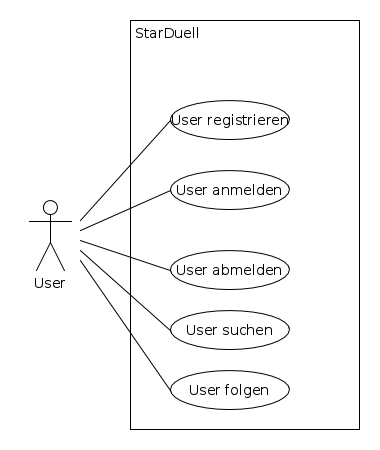
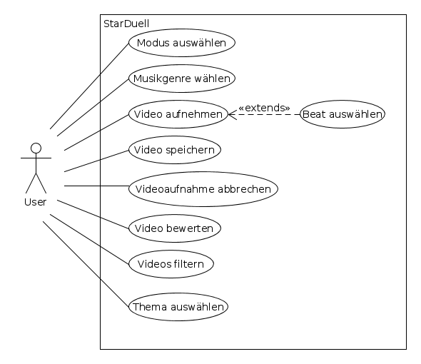

# Was ist Ionic?

[Ionic](https://ionicframework.com/)

# Idee

Starduell ist eine App, mit der man seine musikalischen Künste per Video der Öffentlichkeit zeigen kann. Neben der normalen Aufnahme gibt es die Möglichkeit in einem Duell gegen andere Nutzer anzutreten. Ziel der Applikation ist es, als Unterhaltungsmedium zu fungieren und den Anwender somit zu begeistern.

# Das Verwendungsprinzip

# 1 Anforderungsanalyse
Starduell ist eine App, mit der man seine musikalischen Künste per Video der Öffentlichkeit zeigen kann. Neben der normalen Aufnahme gibt es die Möglichkeit in einem Duell gegen andere Nutzer anzutreten. Ziel der Applikation ist es, als Unterhaltungsmedium zu fungieren und den Anwender somit zu begeistern.
## 1.1	Musskriterien
*	Die Applikation ist für alle mobilen Geräte verfügbar

## 1.2	Wunschkriterien

## 1.3	Abgrenzungskriterien
*	Die Applikation wird nicht für PCs und Notebooks verfügbar sein

# 2	Produkteinsatz
## 2.1	Anwendungsbereiche
Da es sich hierbei um ein Unterhaltungsmedium handelt, ist der Anwendungsbereich im privaten Raum vorgesehen.

## 2.2	Zielgruppen
Die Zielgruppe definiert sich durch, Personen welche an Musik interessiert sind, oder einfach unterhalten werden wollen.  

## 2.3	Betriebsbedingungen

*	Software:

* Hardware:

# Mockups

## Startseite

## Registrieren

## Anmelden

## Modusauswahl

## Profilansicht

## Video Optionen

## Aufnahme

## Bewertung

## Archiv

# Userstories

  * Ich als Benutzer möchte mich anmelden, sodass mir Zugriff auf die App gewährt wird.
  * Ich als Benutzer möchte mich registrieren, sodass ein Benutzerkonto angelegt wird.
  * Ich als Benutzer möchte nach dem Start der Anwendung einen Modus der Anwendung auswählen, sodass sich dessen Unterkategorie öffnet.
  * Ich als Benuter möchte eines der verfügbaren Musik-Genres auswählen, sodass das nächste Eingabefeld angezeigt werden kann.
  * Ich als Benutzer möchte eine der verfügbaren Hintergrundmelodien auswählen, sodass die Vorbereitung der Aufnahme abgeschlossen ist.
  * Ich möchte als Benutzer an jeder Stelle zum Startmenü zurückkehren, sodass die Auswahl des Modus der Anwendung erneut begonnen werden kann.
  * Ich möchte als Benutzer nach dem Start der Anwendung einen Modus der Anwendung auswählen, sodass sich dessen Unterkategorie öffnet.
  * Ich möchte als Benutzer eines der verfügbaren Musik-Genres auswählen, sodass das nächste Eingabefeld angezeigt werden kann.
  * Ich als Benutzer möchte eine der verfügbaren Hintergrundmelodien auswählen, sodass die Vorbereitung der Aufnahme abgeschlossen ist.
  * Ich als Benutzer möchte die Video-Aufnahme mit den ausgewählten Parametern starten, sodass ich aufgenommen werde.
  * Ich als Benuter möchte die laufende Aufnahme abbrechen, sodass ich zum vorherigen Untermenü zurückkehre und die Aufnahme erneut starten kann.
  * Ich als Benutzer möchte die getätigte Aufnahme auf den Server hochladen, sodass diese anderen Benutzern zur Verfügung steht
  * Ich als Benutzer möchte ein Video vom Server ansehen, sodass ich dessen Inhalt sehen, bzw. bewerten kann.
  * Ich als Benutzer möchte ein zuvor angesehenes Video bewerten, sodass meine Bewertung in die auf dem Server gespeicherte einfließt
  * Ich als Benutzer möchte die angezeigten Videos in einer Liste nach Parametern filtern, sodass die angezeigten verfügbaren Videos gefiltert und nach einer neuen Reihenfolge sortiert werden können.

# Use-Case Diagramme

## Gesamtsystem

# Datenmodell

## Vorwort

Für das „Star-Duell“ Projekt wird ein relationales Datenbankensystem verwendet. Ein MySQL Server, welcher auf Linux-Ubuntu 16.04 LTS Basis läuft, verwaltet alle Applikation relevanten Daten.
Der Server steht ausschließlich in Kontakt zum Webserver und niemals direkt zum Anwender.

## ER-Diagramm:

# Architekturmodell

## 1 Ionic

#### 1.1 Was ist Ionic
#### 1.2 Geschichtliche Entwicklung
#### 1.3 Wofür es verwendet wird

#### 1.4 Auf welchen Technologien es basiert
###### 1.4.1 Architekturdiagramm
###### 1.4.2 HTML und CSS
HTML und CSS ermöglichen die präzise, strukturelle und visuelle Definition zum Erscheinungsbild der Applikationen.
###### 1.4.3 JavaScript und NodeJS
Erlauben die Implementierung der Programmlogik und bietet dank dem Node.js Framework eine riesen Bibliothek an bereits fertigen und nützlichen Funktionen.

Des weiteren ist es natürlich auch möglich mit objektorientierten TypeScript Sprachkonzept zu arbeiten, sofern der TypeScript Quellcode letztendlich in JavaScript (eher funktionale Programmierung) umkompilliert wird.
#### 1.5 Anwendungsgebiete
#### 1.6 Vorraussetzungen zur Ausführung

#### 1.7 Tools und Libaries zur Entwicklung
#### 1.8 Installation Ionic
#### 1.9 API
###### 1.9.1 Main Prozess
###### 1.9.2 Renderer Prozess
###### 1.9.3 Beide Prozesse

## 2 SQLite
#### 1.1 Was ist SQLite
Mit SQLite ist man in der Lage eine kleine relationale Datenbank lokal und Server/Client unabhängig zu verwalten. Sie unterstützt einen Großteil der im SQL-92-Standard festgelegten SQL-Sprachbefehle und ist somit weitestgehend mit MSSQL- und MySQL-Skripten kompatibel. Die angelegte Datenbank liegt als einzelne .db Datei vor und ist binär codiert.
#### 1.2 Anwendungsgebiete
SQLite wird meist in relativ kleinen Umgebungen verwendet. Dort wo kleine und überschaubare Datenmengen anfallen und die sich dann jeweils nur auf die entsprechende Anwendung oder dem entsprechendem Gerät beziehen.

Eingesetzt wird es z.B. in den Betriebssystemen Symbian OS und Android. Als auch im Webbrowser Mozilla Firefox zur Datenverwaltung von Cookies und Lesezeichen.
#### 1.3 Vorraussetzungen zur Ausführung
SQLite hat sehr geringe Leistungsansprüche und ist somit auch ideal für eingebettete Systeme geeigenet.

Speicherplatz: ab 300KiB

Arbeitsspeicher: ab 104KiB (Stack = 4KiB & Heap = 100KiB)
#### 1.4 Tools und Libaries zur Entwicklung
Mit dem kostenlosen SQLite Database Browser ist es möglich .db Datein zu öffnen und zu erstellen. Es ist ebenfalls möglich direkt Skripte zu schreiben und sie auszuführen. Datenmanipulation in bestehenden Datenbankdomänen ist auch gegeben.

## 3 REST

## 4 Anhang und Literaturverzeichnis

# Quellen 
