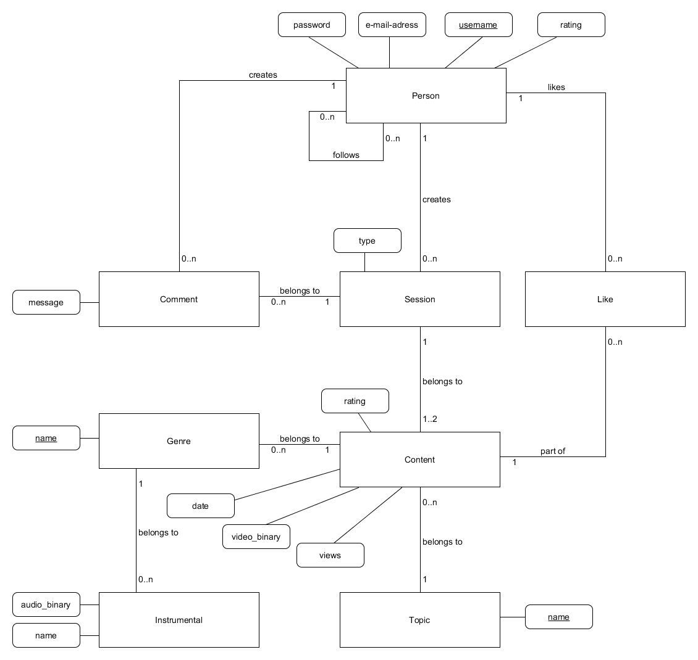

# Vorwort

Für das „Star-Duell“ Projekt wird ein relationales Datenbankensystem verwendet. Ein MySQL Server, welcher auf Linux-Ubuntu 16.04 LTS Basis läuft, verwaltet alle Applikation relevanten Daten.
Der Server steht ausschließlich in Kontakt zum Webserver und niemals direkt zum Anwender.

### ER-Diagramm:

